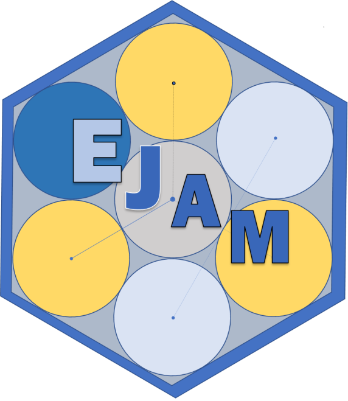

# 

<!-- README.md is generated from README.Rmd. Please edit Rmd not md  -->

```{r, echo=FALSE, eval=FALSE}
# Developer note: 
# If you use index.Rmd or README.Rmd it is your responsibility to 
# knit the document to create the corresponding .md. 
# pkgdown does not do this for you because it only touches 
# files in the ⁠doc/⁠ directory.
#
# 1) Edit your README.Rmd file (the .Rmd NOT the .md file)
# 2) Build your README.md file from the README.Rmd file, by clicking Knit in RStudio
#   also check     devtools::build_readme()  ?
#
# 3) Commit both your README.Rmd and README.md
#
# You could also use GitHub Actions to re-render
# `README.Rmd` every time you push. An example workflow can be found here:
# <https://github.com/r-lib/actions/tree/v1/examples>.
#
# Then... 
#    - **See ?pkgdown::build_site** - EJAM now uses the pkgdown R package to build help and vignettes as web pages, and it uses the README.md (not .Rmd) to help build the documentation.
```

```{r, include = FALSE}
knitr::opts_chunk$set(
  collapse = TRUE,
  comment = "#>",
  fig.path = "man/figures/README-",
  out.width = "100%"
)
```

<!-- badges: start -->

```{=html}
<!-- or we could comment out the badge 

[](https://lifecycle.r-lib.org/articles/stages.html#experimental)
 -->
```
<!-- badges: end -->

EJScreen's Environmental Justice Analysis Multisite Tool (EJAM) is a resource provided by the United States Environmental Protection Agency (US EPA). It lets you easily and quickly see demographic and environmental information aggregated within and across hundreds or thousands of places, all at the same time.

### What is EJAM?

-   [What is EJAM?](articles/0_whatis.html)

### EJAM as a Web Application

[EJAM can be used as a web app](articles/0_webapp.html), providing a simple user interface that lets anyone quickly see the results of a basic analysis.

### EJAM as a Software Toolkit (and Local Web App) for Analysts and Developers

EJAM is also available to analysts and developers as an R Package written in the [R programming language](https://www.r-project.org/), with source code on GitHub. When used in RStudio, the EJAM package provides functions to help analysts work with block group data, points, and polygons, to very quickly aggregate and compare large numbers of locations.

Again, installing the R package also allows one to use [EJAM as a local web app](articles/0_webapp.html) if the shiny app is launched locally on a user's own computer.

More information about the EJAM R package:

-   [Installing the R package](https://usepa.github.io/EJAM/articles/1_installing.html)

-   [Quick Start Guide](https://usepa.github.io/EJAM/articles/2_quickstart.html)

-   [Basics of Using EJAM for Analysis in RStudio](https://usepa.github.io/EJAM/articles/3_analyzing.html)

-   [Advanced Features](https://usepa.github.io/EJAM/articles/4_advanced.html)

-   [Reference Manual - EJAM R Functions and Data](https://usepa.github.io/EJAM/articles/index.html)

-   [GitHub Repository - Open Source Code and Data](https://usepa.github.io/EJAM/articles/1_installing.html)

#### Open-Source Code Policy

Effective August 8, 2016, the [OMB Mandate: M-16-21; Federal Source Code Policy: Achieving Efficiency, Transparency, and Innovation through Reusable and Open Source Software](https://obamawhitehouse.archives.gov/sites/default/files/omb/memoranda/2016/m_16_21.pdf){.uri target="_blank" rel="noreferrer noopener"} applies to new custom-developed code created or procured by EPA consistent with the scope and applicability requirements of Office of Management and Budget's (OMB's) Federal Source Code Policy. In general, it states that all new custom-developed code by Federal Agencies should be made available and reusable as open-source code.

The EPA specific implementation of OMB Mandate M-16-21 is addressed in the [System Life Cycle Management Procedure](https://www.epa.gov/irmpoli8/policy-procedures-and-guidance-system-life-cycle-management-slcm){.uri target="_blank" rel="noreferrer noopener"}. EPA has chosen to use GitHub as its version control system as well as its inventory of open-source code projects. EPA uses GitHub to inventory its custom-developed, open-source code and generate the necessary metadata file that is then posted to code.gov for broad reuse in compliance with OMB Mandate M-16-21.

If you have any questions or want to read more, check out the [EPA Open Source Project Repo](https://github.com/USEPA/open-source-projects){.uri target="_blank" rel="noreferrer noopener"} and [EPA's Interim Open Source Code Guidance](https://www.epa.gov/developers/open-source-software-and-epa-code-repository-requirements){.uri target="_blank" rel="noreferrer noopener"}.

#### Contributing

We encourage analysts and developers to test the EJAM R package and the EJAM shiny app, and provide feedback, or to share code, and we welcome your suggestions or contributions.

-   [How to Contribute](https://usepa.github.io/EJAM/CONTRIBUTING.html)

#### License

By submitting a pull request or issue, you are agreeing to comply with a waiver of copyright interest.

#### Disclaimer for App

This software/application has been approved for release by the U.S. Environmental Protection Agency (USEPA). Although the software has been subjected to rigorous review, the USEPA reserves the right to update the software as needed pursuant to further analysis and review. No warranty, expressed or implied, is made by the USEPA or the U.S. Government as to the functionality of the software and related material nor shall the fact of release constitute any such warranty. Furthermore, the software is released on condition that neither the USEPA nor the U.S. Government shall be held liable for any damages resulting from its authorized or unauthorized use.

#### Disclaimer for GitHub Repository Content

The United States Environmental Protection Agency (EPA) GitHub project code is provided on an "as is" basis and the user assumes responsibility for its use. EPA has relinquished control of the information and no longer has responsibility to protect the integrity, confidentiality, or availability of the information. Any reference to specific commercial products, processes, or services by service mark, trademark, manufacturer, or otherwise, does not constitute or imply their endorsement, recommendation or favoring by EPA.

**The EPA seal and logo shall not be used in any manner to imply endorsement of any commercial product or activity by EPA or the United States Government.**

### Contact

If you have questions or comments, please email [ENVIROMAIL_GROUP\@epa.gov](mailto:ENVIROMAIL_GROUP@epa.gov?subject=EJAM%20package%20question) and put "EJAM package question" in the subject line.
