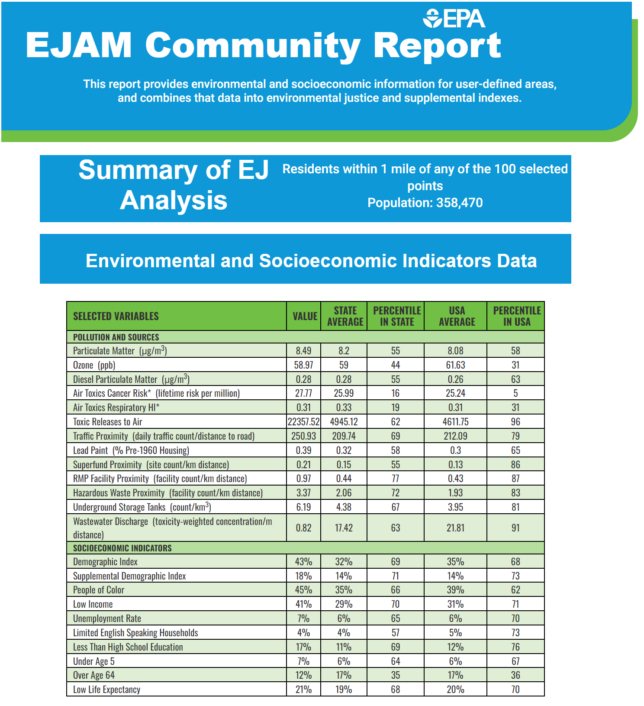
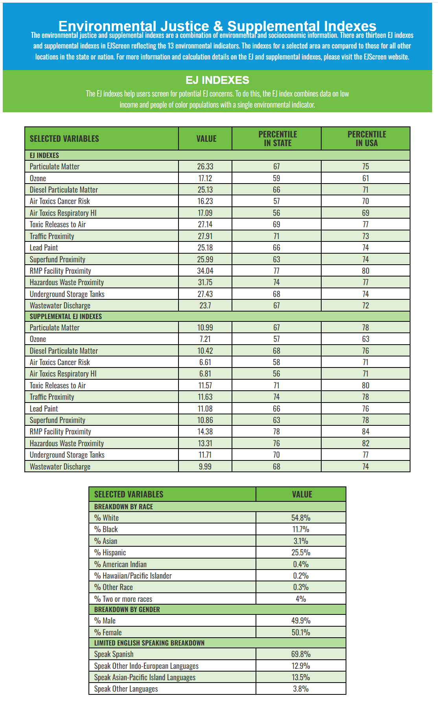
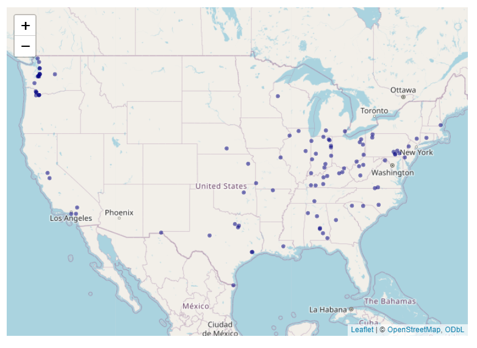
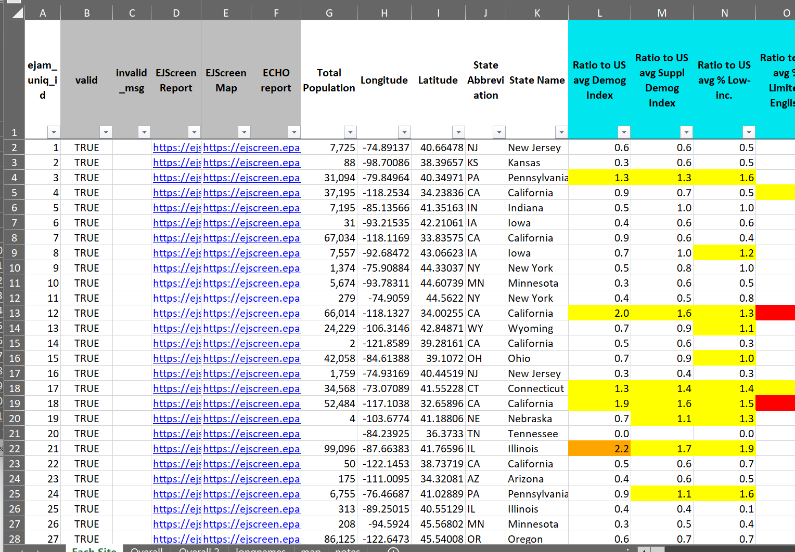

```{r developernote, eval=FALSE, echo= FALSE, include = FALSE}
#  *>>>>>>>>>> Developer note: vignettes need to be tested/edited/rebuilt regularly <<<<<<<<<<<*
#    - **See ?pkgdown::build_site** and script in EJAM/data-raw/- EJAM uses the pkgdown R package to build help and articles/ vignettes as web pages
```

```{r SETUP_default_eval_or_not, include = FALSE}
knitr::opts_chunk$set(
  collapse = TRUE,
  comment = "#>"
)
knitr::opts_chunk$set(eval = FALSE)
# https://r-pkgs.org/vignettes.html
```

```{r libraryEJAM, eval = TRUE, echo= FALSE, include= FALSE}
# rm(list = ls())
# golem::detach_all_attached()
# 
library(EJAM)
dataload_from_pins('all') # varnames = all  currently means all these:
# dataload_from_pins(
#   c("blockwts", "blockpoints", "blockid2fips", "quaddata", 
#     "bgej", "bgid2fips",
#     "frs", "frs_by_programid", "frs_by_naics", "frs_by_sic", "frs_by_mact")
# )

##################################### #
# if (!exists("blockid2fips")) {
#   cat("warning: blockid2fips not available\n")
#   # *** temporary workaround if building vignette on 1 particular machine
#   here <- "~/../Downloads/EJAMbigfiles"
#   varnames <- c('blockwts', 'blockpoints', 'blockid2fips', "quaddata",
#                 'bgej','bgid2fips',
#                 'frs', 'frs_by_programid', 'frs_by_naics', "frs_by_sic", "frs_by_mact")
#   fnames <- paste0(varnames, ".arrow")
#   localpaths  <- paste0(here, '/', fnames)
#   for (i in 1:length(varnames)) {
#     if (!exists(varnames[i])) {
#     assign(varnames[i], arrow::read_ipc_file(file = localpaths[i]))
#     }}
#   rm(here, varnames, fnames, localpaths)
# }
##################################### #

indexblocks()

```

# A Brief Intro to Using EJAM in RStudio

This document is about analysts or coders using the EJAM R package in RStudio. After you [install the EJAM R package](https://usepa.github.io/EJAM/articles/1_installing.html), this document explains how you can run an EJAM analysis and view results right away using R.

This document is not about [using EJAM as a web application](https://usepa.github.io/EJAM/articles/0_webapp.html), but you can launch a local web app after installing the EJAM R package.

## Load EJAM

To start using EJAM in RStudio/R, you first attach/load the R package using `library()` or `require()`.
```{r library, eval=FALSE}
library(EJAM)
```

## Analyze Places with `ejamit()`

To quickly try EJAM in RStudio:

```{r ejamit100, message=FALSE, warning=FALSE, echo=TRUE, eval=FALSE}
# EJAM analysis of 100 places, for everyone within 3 miles
out <- ejamit(testpoints_100, radius = 3)

pts <- sitepoints_from_any(c("30.97740, -83.36900", "32.51581, -86.37732"))
out2 <- ejamit(pts, radius = 2)
```

To quickly try EJAM with an example input file (spreadsheet with latitude and longitude of each point)

```{r, eval=FALSE}
myfile <- system.file("testdata/latlon/testpoints_10.xlsx", package = "EJAM")

out <- ejamit(myfile, radius = 3)
```

If you already have your own spreadsheet of point locations to analyze, then in RStudio you can just use the `ejamit()` function without specifying the locations or radius -- EJAM will prompt you to select the file and a radius.

```{r notevaluated, eval=FALSE}
out <- ejamit()
```
Note: The file should be an Excel file or .csv file and the first sheet (tab) needs to be just a table of one header row (with at least two columns named lat and lon), and one row per site (point). No extra rows, no merged cells, etc.

If you need examples of spreadsheets (and other input files you can try), you can find the ones installed with the EJAM package in your local folder, like this in the RStudio console: 

```{r systemfile, eval=FALSE, echo=TRUE}
## See where the folder is and see what files are there:
testdata()

# or see just the latlon files:
dir(system.file("testdata/latlon", package = "EJAM"))
```


## Pick a Radius

You can specify the radius in miles. EJAM will analyze all residents within that many miles of each point (site).
```{r RADIUS, eval = TRUE}
radius <- 3 # radius (in miles).  5 km = 3.106856 miles, 10 km = 6.2 miles
```
Converting between miles and kilometers -- If you know you want to analyze for 5 kilometers, for example, you can turn it into miles.
```{r convert units, eval=TRUE}
5000 / meters_per_mile
convert_units(5, 'km', 'miles')
```


## Map your sites before analyzing them

This creates an interactive map. Click a point on the map to see a popup with details about that point.

```{r eval = FALSE}
# input to EJAM
pts <- testpoints_100
mapfast(pts)
```
 
## Map results with `ejam2map()`

This also creates an interactive map. Click a point on the map to see a popup with details about people near that point.

```{r map100, eval = TRUE}
out <- testoutput_ejamit_100pts_1miles
ejam2map(out)
```
 

## Report via `ejam2report()` (interactive html file)

```{r eval=FALSE, include=FALSE}
# we should add HTML output in vignette, below, for ejam2report() example
```

```{r ejam2report1, eval=FALSE}
out <- testoutput_ejamit_100pts_1miles
ejam2report(out)

y <- ejam2report(out, sitenumber = 1, analysis_title = "Site #1")
```

{width="100%"}

{width="100%"} {width="100%"}

{width="100%"}

## Table of Results in RStudio console

As an alternative to the pdf report created by `ejam2report()`, 
this gives you a quick, simple list of results for all the indicators:
```{r ejam2table_tall, eval=FALSE}
ejam2table_tall(out)
ejam2table_tall(out, sitenumber = 1)
```


## Barplot

```{r ejam2barplot, eval=FALSE, echo=TRUE}
out <- testoutput_ejamit_100pts_1miles

# Check long list of indicators for any that are elevated

ejam2barplot(out,
  varnames = names_these_ratio_to_avg,
  main = "Envt & Demog Indicators at Selected Sites Compared to State Averages")

ejam2barplot(out,
  varnames = names_these_ratio_to_state_avg,
  main = "Envt & Demog Indicators at Selected Sites Compared to State Averages")


# Demographics only

# vs nationwide avg
ejam2barplot(testoutput_ejamit_100pts_1miles)

# vs statewide avg
ejam2barplot(testoutput_ejamit_1000pts_1miles,
  varnames = c(names_d_ratio_to_state_avg, names_d_subgroups_ratio_to_state_avg),
  main = "Demographics at Selected Sites Compared to State Averages")


# Environmental only

ejam2barplot(testoutput_ejamit_100pts_1miles,
  varnames = c(names_e_ratio_to_avg, names_e_ratio_to_state_avg),
  main = "Environmental Indicators at Selected Sites Compared to Averages")
```

```{r}
# see more examples at ?ejam2barplot
```


## View Results Spreadsheet via `ejam2excel()` (to Launch Excel)

```{r table_xls_from_ejam-launchexcel, eval=FALSE}
out <- testoutput_ejamit_100pts_1miles
ejam2excel(out, launchexcel = T, save_now = F)
```

### Save Results as a Spreadsheet file

```{r table_xls_from_ejam-savenow, eval=FALSE}
ejam2excel(out, save_now = T)
```

{width="100%"}

------------------------------------------------------------------------

## More about points


### Use one point

```{r one point, eval=FALSE}
pts <- data.frame(lon = -92.380556, lat = 31.316944)
```

### Use a few points

```{r ptstypedin, eval = TRUE}
pts <- sitepoints_from_any(c(
  "34.8799123, -92.1",
  "30.2906971, -91.8",
  "30,         -95"
))
## or
pts  <- data.frame(
  lon = c(-92.1,      -91.8), 
  lat = c(34.8799123, 30.2906971)
)

pts
```

### Create a random sample of points representative of the average facility, average resident, or average area

You can create a set of random points with function `testpoints_n()` that can be weighted to represent the average resident, average regulated facility, average point on a map weighted by square meters, etc. See more details in the documentation of the function `testpoints_n()`.

Create random test data points in States of LA and TX

```{r mapfast_testpoints_n, eval = TRUE, fig.height=6, fig.width=6}
# p1k <- testpoints_n(1000)
# mapfast(p1k)

mapfast(testpoints_n(300, ST = c('LA','TX'), weighting = 'bg'), radius = 0.1) 
# weighting = "frs" better represents regulated facilities,
# but requires loading the (large) frs dataset
```


# Documentation of Functions and Data

- [README](../index.html){.uri target="_blank" rel="noreferrer noopener"}
- [Function Reference Document](../reference/index.html){.uri target="_blank" rel="noreferrer noopener"}
- In RStudio, see `?EJAM`

```{r helpEJAM, eval=FALSE, include=TRUE}
?EJAM
# or 
help("EJAM", package='EJAM')

?ejamit()
```
