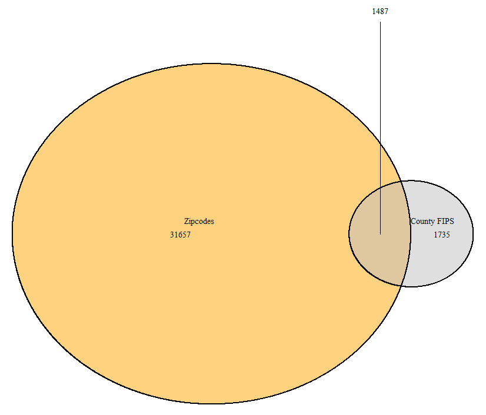

# How to use EJAM to analyze zip codes

EJAM can analyze various kinds of Census-defined areas, including States, Counties, Tracts, Blockgroups, and Cities/CDPs/etc.

However, you may need to analyze zip codes.

Census uses ZIP Code Tabulation Areas (ZCTAs), which are generalized areal representations of United States Postal Service (USPS) ZIP Code service areas. See `help("zctas", package="tigris")`

Note a zip can be the same as a county fips in many cases, as with 10001!

{width="75%"}

EJScreen's API does not handle zip codes. It can show where the center of the zip code is but will not map its bounds or provide a report easily via the API.

```{r, eval=FALSE, include=TRUE}
# Just see where the zipcode is, not its boundaries
browseURL(url_ejscreenmap(wherestr =  '10001'))
```

**To map and analyze zip codes you can download shapefiles for them and analyze or map them in EJAM as shown below.**

## downloading zcta polygons

Takes time to download!

```{r tigris, eval=FALSE, include=TRUE}
library(tigris)
options(tigris_use_cache=TRUE)
options(tigris_refresh=FALSE)
#zcta_DE <- zctas(starts_with = fips_from_name('DE'), keep_zipped_shapefile = T) # all in the state
#zcta1 <- zctas(starts_with = c("10001"))  # one zip
zcta2 <- zctas(starts_with = c("10012", "10506"))  # two zipcodes

z = shapefile_from_any(zcta2)
```

## mapping zcta polygons

```{r, eval=FALSE, include=TRUE}
mapfast(z)
```

## analyzing zip codes in EJAM

The EJScreen API does not handle zip codes, but you can analyze them in EJAM like this:

```{r, eval=FALSE, include=TRUE}
out = ejamit(shapefile = z, radius = 0)
```

## summary report on zipcodes

```{r, eval=FALSE, include=TRUE}
ejam2report(out, 
            analysis_title = "Zip codes",
            submitted_upload_method = 'SHP', 
            data_up_shp = z)
```

## compare sites

```{r, eval=FALSE, include=TRUE}
# put zip code in the x axis labels!
ejam2barplot_sites(out, names.arg = z$GEOID20, sortby = FALSE) # zcta2$GEOID20

# This table view works, but the links to reports do not work with zipcodes
ejam2tableviewer(out)
```

## map of detailed results

```{r, eval=FALSE, include=TRUE}

out_plus_shape = sf::st_as_sf(
  data.frame(out$results_bysite, z)
  )
# put zip code in the map popups!
out_plus_shape$ejam_uniq_id = paste0(out_plus_shape$ejam_uniq_id, " (zip ", z$GEOID20, ")")
mapfastej(out_plus_shape)
```

Note that `ejam2map()` will not work for zipcodes!
